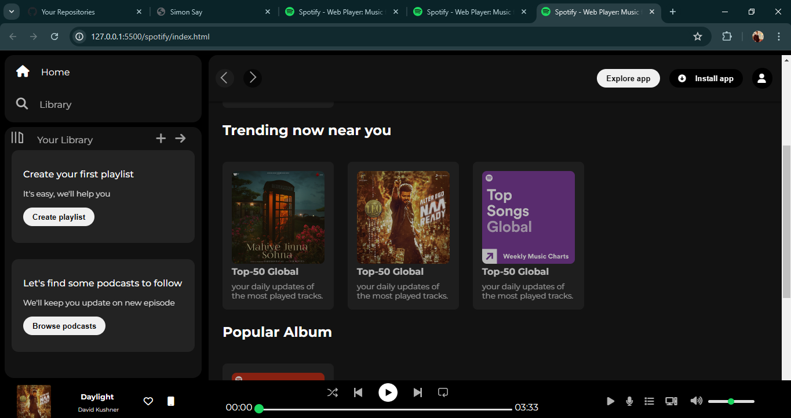

i# Spotify Clone

# Description

This project is a simple clone of the Spotify web interface, created using only HTML and CSS. The aim of this project is to replicate the basic design and layout of Spotify's popular music streaming service, providing a visually similar user experience.

# Features

Homepage: A landing page that mimics Spotify's homepage, featuring a navigation bar, a main content area with a hero section, and a footer. 

Navigation Bar: A responsive top navigation bar with links to Home, Search, and Library. 

Hero Section: A large, prominent section on the homepage showcasing featured playlists or promotions. 

Content Sections: Organized sections displaying playlists, albums, and artists in a grid layout. 

# Interface

</img>

# Technologies Used

HTML: For the structure and content of the web pages. 
CSS: For styling and layout, including Flexbox and Grid for responsive design.

# How to Use

Clone the repository:  
Copy code 
git clone https://github.com/tapeshchavle/spotify-clone.git 
Navigate to the project directory: 

Copy code 
cd spotify-clone 
Open index.html in your web browser: 

Copy code  
open index.html  
or simply double-click the index.html file. 
Folder Structure  

<pre>
Copy code
spotify-clone/
├── index.html
├── css/
│ └── styles.css
└── images/
</pre>

# Contributing

If you wish to contribute to this project, please fork the repository and submit a pull request. Contributions are always welcome!

# This website is not fully responsive
